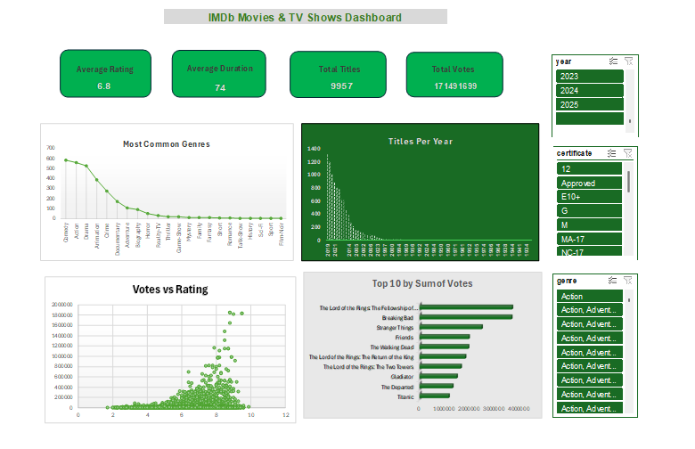

# IMDb Movies & TV Shows Analytics Dashboard

## 📊 Project Overview

This project analyzes IMDb data using Excel and SQL to uncover insights about movies and TV shows.

## 🛠 Tools Used

* Microsoft Excel (Data Cleaning & Dashboard)
* MySQL (Data Analysis)
* GitHub (Project Hosting)

## 🔍 Key Insights

* Trends in content release over years
* Most popular genres
* Top titles by votes
* Relationship between votes and ratings

## 📸 Dashboard Preview

## 📁 Files

* imdb_dashboard.xlsx
* queries.sql
* dashboard.png
